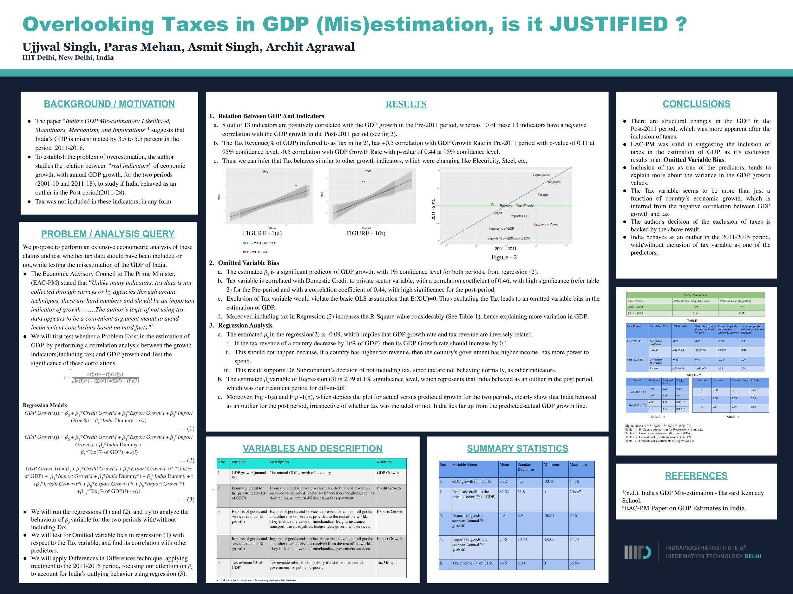

# Overview

* This repository contains the source code of the project "Overlooking Taxes in GDP (Mis)estimation".
* In this project we performed an extensive econometric analysis to test whether tax data should
have been included or not included while testing the mis-estimation of the GDP of India.
* Please look at 'Report.pdf' for more details.

## Poster:

